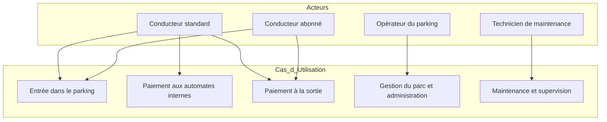
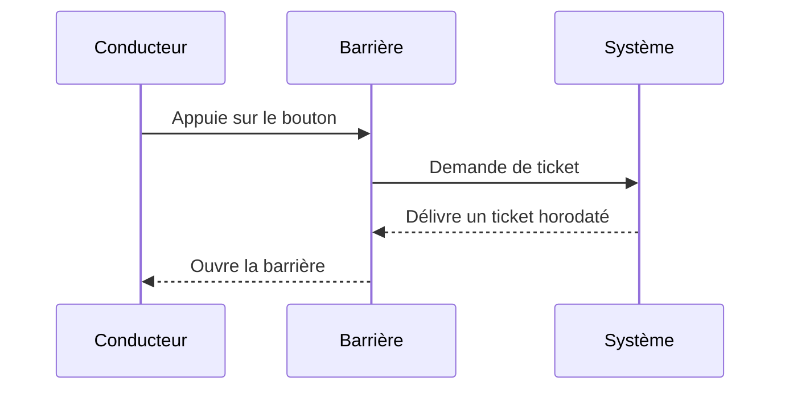
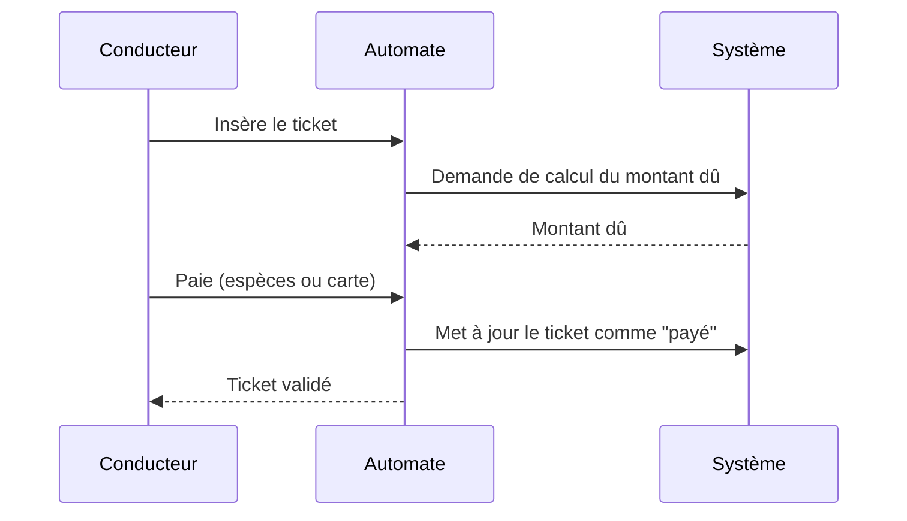
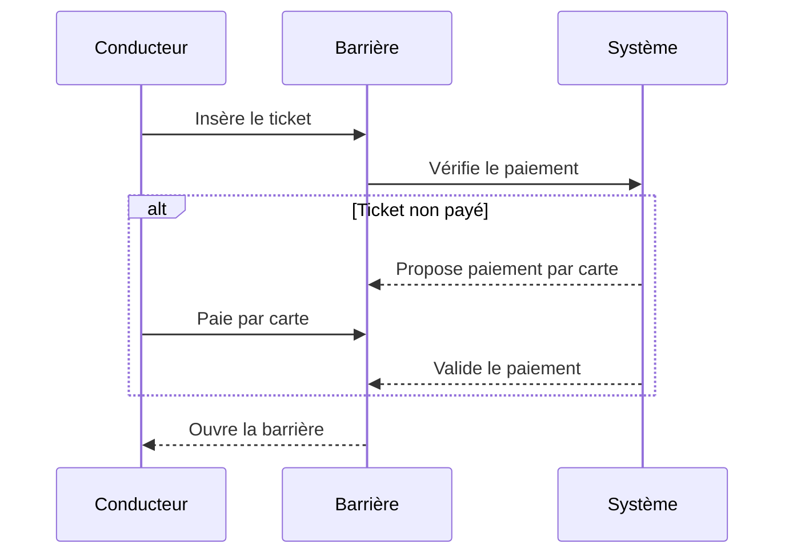
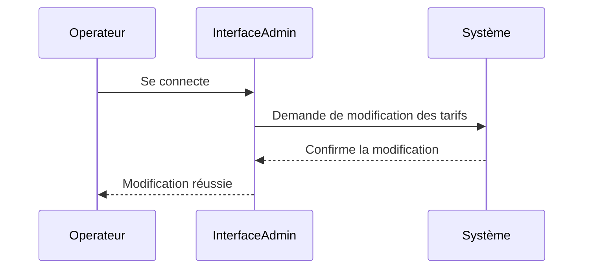
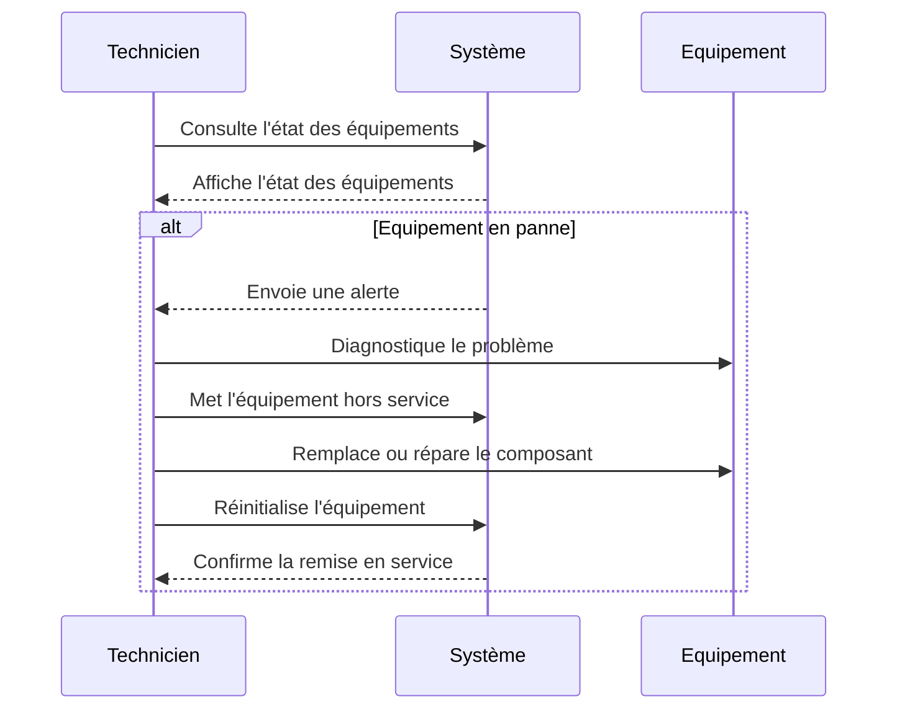

## Diagramme des cas d’utilisation

## Diagrammes de séquence

### Entrée dans le parking

- Objectif : Permettre à un véhicule d’entrer.
- Description : Le conducteur s’arrête devant la barrière d’entrée, appuie sur un bouton (ou capteur de présence), le système délivre un ticket horodaté et ouvre la barrière. Le ticket indique la date, l’heure d’entrée et un numéro unique.
- Exceptions : Barrière défaillante, imprimante de tickets en panne, parking complet (dans ce dernier cas, la barrière reste fermée).

### Paiement aux automates internes

- Objectif : Permettre au conducteur de régler son stationnement avant de sortir.
- Description : L’usager insère son ticket dans l’automate. Le système calcule le montant dû. L’usager paie en espèces ou par carte. L’automate met à jour le ticket comme “payé”.
- Exceptions : Automate en panne, carte bancaire refusée, paiement incomplet.

### Paiement à la sortie

- Objectif : Permettre le règlement et la sortie du véhicule depuis la barrière de sortie.
- Description :
Cas standard (ticket) : Le conducteur insère son ticket. Si non payé, le système propose un paiement par carte bancaire. Une fois payé, la barrière s’ouvre.
- Cas télépéage : Le véhicule est détecté, le badge est lu, le compte du conducteur est débité, la barrière s’ouvre sans action supplémentaire.
Exceptions : Carte refusée, badge non valide, barrière en panne.

### Gestion du parc et administration

- Objectif : Permettre à l’opérateur d’accéder aux informations de fonctionnement du parking.
- Description : L’opérateur se connecte à une interface d’administration pour :
Modifier les tarifs (par heure, forfait, réduction, etc.)
Consulter le nombre de places occupées et disponibles
Suivre les transactions journalières et mensuelles, extraire des statistiques
Surveiller l’état des barrières, des automates, et initier des demandes de maintenance.

### Maintenance et supervision

- Objectif : Permettre au technicien de diagnostiquer et de résoudre les problèmes.
- Description : Le technicien consulte l’état des équipements (barrières, automates, lecteurs de badges) et reçoit des alertes en cas de dysfonctionnement. Il peut mettre un automate hors service, remplacer des composants, réinitialiser la barrière, etc.

### Liste de contraintes et règles métiers

- Tarif : Calcul du tarif en fonction de la durée du stationnement et éventuellement d’une grille tarifaire (première heure gratuite, forfait soirée, etc.).
- Temps maximal de stationnement : Définir une durée maximale de stationnement.
- Conditions particulières : Gestion des tickets perdus, pannes des automates, barrières bloquées, etc.
- Disponibilité : Le système doit être opérationnel 24h/24, 7j/7.
- Performance : Le temps d’attente pour la délivrance d’un ticket ou l’ouverture d’une barrière doit être minimal (moins de 1 seconde).
- Sécurité : Les transactions par carte bancaire doivent être sécurisées, les données des badges de télépéage protégées.
- Capacité : Le système doit gérer au moins 1000 transactions par jour, avec un pic possible à 200 véhicules par heure le matin et en fin d’après-midi.
- Évolutivité : Possibilité d’ajouter de nouveaux modes de paiement, de nouveaux tarifs, ou de nouveaux types de badges.